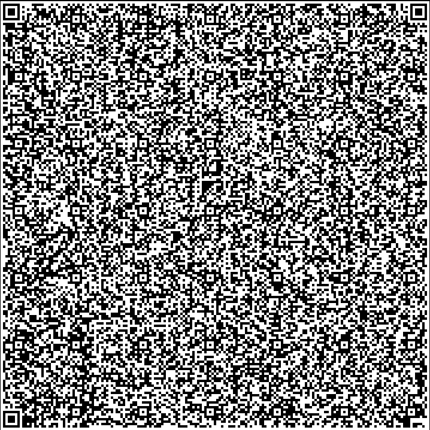

# Remime Web Lite ⏰

An easy and efficient way to manage your time using your browser! 
Checkout the original remime application [here](https://github.com/ShibamRoy9826/remime)!

It is a part of the YSWS(You Ship! We Ship!) organized by [Hackclub](https://hackclub.com/) called [SayCheese](https://saycheese.hackclub.com) (Thank you [@nora](https://github.com/24c02) , [@kestral](https://github.com/commonkestrel) and other organisers ❤️!) , As the task was to fit everything in a QR code(Which can hold 2953 bytes of data at most) , I had to compromise with a lot of features, but its still fun to have a whole application in a qr code, isn't it?

## Features 😎

- Modes include: Stopwatch, 12-hour Clock, 24-hour Clock and Timer
- Made with catppuccin color scheme :)
- So light, that it's stored in a QR code!

You can scan this QR code to run this application directly on your browser:



If you feel lazy, and don't want to scan it, No problem! You can copy paste this to your browser, that should work as well!
```
data:text/html;charset=utf-8,%3Cbody%3E%3Cscript%3Enew%20Response(Uint8Array.from(atob(%22nVfrcqM2FH4VQiYTSDAG27ksNmR20067PzLd6e4LCCGMahAeSZi42O%2FeIyDBjsG708w4Fkffp3M%2FyIuLKMdyuyZaIrM0WIR5tA0WQm5TEtxUIcKrJc8LFo1wnubcu3TVXzhvn3AU3cezfUQ3VUTFOkVbL07J6%2FyfQkgab4HEJGHSw%2FCP8DlK6ZKNqCSZaEX7xK0keZWjeusNFwNtJOi%2FxJtxku3DQsqc9Rjz%2BCmcxWge5jwifMRRRAvh2XfAaWXeZP2qiTylkXb5ED%2FOPuF5hviSMs%2B%2BV6iSRjLxHtUyIXSZSK8md%2Frd5rRj5yVHTFBJczjmTjTosqE%2FOM58jaKIsqVnTzvjvTjHhbDahyTfEN7jTzx9DNHjGwVhSTekOtDmiPkpCUXT6A7vKVsXsuoLxYk3bQjcLgIPylJ7yddVGwbX2STtnus4m3J%2FKWlGul3nqtu92tvyVVYf1ewX46aMFlAeGk6RED5ogBKr3dNyhlOKVz6WhqnRyMehZMFkNkq49pzmeLUYN8BTgto1zOA8Ssh8XSKJE0B%2Bf1sPopV3HJA%2F1PeZM3lrrFrBsYjLQTAXLRYWwd9EkGFoVkjSYNVKq8PmvzUUyxkJXkDe0ccQ0TqsTWyBB9kXfbxFXRYKkXCqqT73WZGFhGsblBbEd8ZaoC3EGrE2Q5DJIOHCguSB8ICfUTZ0wEc%2BQIWlnZwgCP7VEwAq3viNs%2BNDb1W2gkXitrzau8BxWobmvYvBkl45nN%2FJO6lEMnhXq45vtArM6VoGMMyE1JgPA7PIYFDZSyJ%2FT4laftl%2BjQw94bppyeF9sAYAeBgAZgGAnNNAAZCfVaEQ%2FKwOhSjOIKC2AUGHEVDRAEjPHYEUAg0jVB18kSoeYhikqhoQ0TBCDQ3dnEd2Xft2Nx2f1XD09Uscovv4QbfoIOJhhh8g7lbxM8Q8JVLLfEZKo6Qsykv7cxHR%2FFm9417lbtcKSxKuqOzdQgdC04qt0netle9YIXwSazOPC4bVoIdOMMwKpwTxr%2BqFCI1ixEDwL9x9h4HxUpX%2BRWlFNmWM8B9wql8%2BXR%2FM0Gvv2p10Tx2ZwwvKYGalXJJ%2BZmNOkCR%2FCUzTFMkcRiHU6Zv4D0SZYc6lDR3ACOjFsPv%2BkNkRgbc9Q%2BpgqH8II4xFEOOCc0iUGqmNOF8fS28NttvdOY45dskUilYNzAP%2FmjFfiTYv7VzzdTXYunR9ENN%2BcbzbGTG0vXyPJ%2FGDaqOSqf0GLoJ9XQyNjaqzF8pg6ArDvNV104aXej3ujYl17Vwr%2Fz%2FivxOISDSEL58MdkL5My84EK7cSS%2FHnQSHsKf04ABd%2B%2Fyie8eSby%2B66RlHMt0a1Nqn0txbKhWHWWCqzMLb22OPw6t7p9fmozi%2BIJnYcZpDPRnhSHHMMXx6iexnxOm90089MnairPX95MmoS3yqCqu3kUyvdu2gJVT5VWeipzuOfuRfLcAfBaqZi0NhbesvzBdLdX1nT3PZqOIno9f%2B%2F6cD6uOI9w0VgpzjNVdS3XJ9f%2FV03EEQv7paPONEPqk3rMRXSbshdv2mv713bvJ2yZtv88jf9wtbtYLBWOfjtM1DNRZ6%2BryV90%2BLTkt70QMNk1bDCUP9gumZL%2BcV79txBdeH5rbwHw%3D%3D%22)%2C(e%3D%3Ee.charCodeAt(0)))).body.pipeThrough(new%20DecompressionStream(%22deflate-raw%22)).getReader().read().then(((%7Bvalue%3Ae%7D)%3D%3E(document.open()%2Cdocument.write((new%20TextDecoder).decode(e))%2Cdocument.close()))).catch(console.error)%3C%2Fscript%3E
```


> [!NOTE]
> Fun Fact: The name Remime actually stands for "REMInd ME"


## Known bugs 🐞

- None, Please report any bugs if you find!

## Contributing 🤝

Everyone is welcome to contribute to the code!

You can also raise an issue, or suggest any features that you think would be great :)

> ✨ Please star this repository if you liked this project 😁
